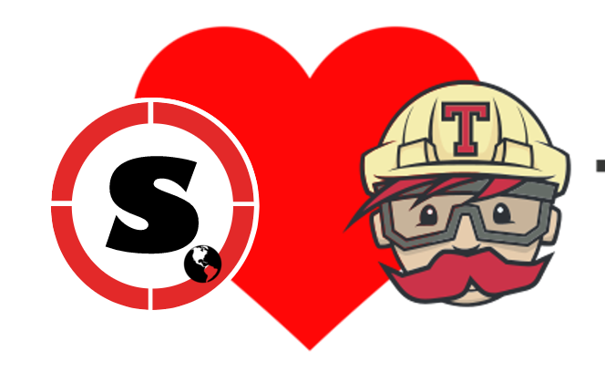

# Singularity-CI

This is a simple example of how you can use Continuous Integration (Travis) to build your images! The cool part is that you have complete power to configure the build, and then to push to your storage endpoint of choice.

## Getting Started

### 0. Fork this repository

You can clone and tweak, but it's easiest likely to get started with our example files and edit them as you need.

### 1. Get to Know Travis

We will be working with [Travis CI](https://www.travis-ci.org). You can see example builds for this [repository here](https://travis-ci.org/singularityhub/singularity-ci/builds).

 - Travis offers [cron jobs](https://docs.travis-ci.com/user/cron-jobs/) so you could schedule builds at some frequency.
 - Travis also offers [GPU Builders](https://circleci.com/docs/2.0/gpu/) if you want/need that sort of thing.
 - If you don't want to use the [sregistry](https://singularityhub.github.io/sregistry-cli) to push to Google Storage, Drive, Globus, Dropbox, or your personal Singularity Registry, travis will upload your artifacts directly to your [Amazon S3 bucket](https://docs.travis-ci.com/user/uploading-artifacts/).
 
### 2. Add your Recipe(s)

For the example here, we have a single recipe named "Singularity" that is provided as an input argument to the [build
script](build.sh). You could add another recipe, and then of course call the build to happen more than once. The build script will name the image based on the recipe, and you of course can change this up.

### 3. Configure Singularity

The basic steps to [setup](setup.sh) the build are the following:

 - Install Singularity from master branch. You could of course change the lines in [setup.sh](setup.sh) to use a specific tagged release, an older version, or development version.
 - Install the sregistry client, if needed. The [sregistry client]() allows you to issue a command like "sregistry push ..." to upload a finished image to one of your cloud / storage endpoints. By default, this won't happen, and you will just build an image using the CI.

### 4. Configure the Build

The basic steps for the [build](build.sh) are the following:

 - Running build.sh with no inputs will default to a recipe called "Singularity" in the base of the repository. You can provide an argument to point to a different recipe path, always relative to the base of your repository.
 - If you want to define a particular unique resource identifier for a finished container (to be uploaded to your storage endpoint) you can do that with `--uri collection/container`. If you don't define one, a robot name will be generated.
 - If you add `--cli` then this is telling the build script that you have defined the [needed environment variables](https://docs.travis-ci.com/user/environment-variables/#Defining-Variables-in-Repository-Settings) for your [client of choice](https://singularityhub.github.io/sregistry-cli/clients) and you want successful builds to be pushed to your storage endpoint. Valid clients include:
    - google-storage
    - google-drive
    - dropbox
    - globus
    - registry (Singularity Registry)

See the [.travis.yml](.travis.yml) for examples of this build.sh command (commented out). If there is some cloud service that you'd like that is not provided, please [open an issue](https://www.github.com/singularityhub/sregistry-cli/issues).

### 5. Connect to CI

If you go to your [Travis Profile](https://travis-ci.org/profile) you can usually select a Github organization (or user) and then the repository, and then click the toggle button to activate it to build on commit --> push.

That's it for the basic setup! At this point, you will have a continuous integration service that will build your container from a recipe each time that you push. The next step is figuring out where you want to put the finished image(s), and we will walk through this in more detail.

## Storage!

Once the image is built, where can you put it? An easy answer is to use the [Singularity Global Client](https://singularityhub.github.io/sregistry-cli) and choose [one of the many clients](https://singularityhub.github.io/sregistry-cli/clients) to add a final step to push the image. This comes down to the following. The first step is already done for you in the example, so you just need to do `2.` and `3.`

 1. installing `sregistry` to the builder with pip
 2. Saving the credentials / other environment variables that your client needs (see the client settings page linked in the sregistry docs above) to your [repository settings](https://docs.travis-ci.com/user/environment-variables/#Defining-Variables-in-Repository-Settings) where they will be encrypted and in the environment.
 3. adding a line to your .travis.yml to do an sregistry push action to the endpoint of choice. We have provided some (commented out) examples to get you started. 

## Travis Provided Uploads
You don't even need to use sregistry to upload a container (or an artifact / result produced from running one via a cron job maybe?) to an endpoint of choice! There are a [crapton](https://docs.travis-ci.com/user/deployment) of places you can deploy to. If you can think of it, it's on this list. Here are a sampling of some that I've tried (and generally like):

 - [Surge.sh](https://docs.travis-ci.com/user/deployment/surge/) gives you a little web address for free to upload content. This means that if your container runs an analysis and generates a web report, you can push it here. Each time you run it, you can push again and update your webby thing. Cool! Here is an [old example](http://containers-ftw.surge.sh/) of how I did this - the table you see was produced by a container and then the generated report uploaded to surge.
 - [Amazon S3](https://docs.travis-ci.com/user/deployment/s3/) bread and butter of object storage. sregistry doesn't have a client for it (bad dinosaur!) so I'll direct you to Travis to help :)
 - [Github Pages](https://docs.travis-ci.com/user/deployment/pages/) I want to point you to github pages in the case that your container has documentation that should be pushed when built afresh.

## Advanced

Guess what, this setup is totally changeable by you, it's your build! This means you can do any of the following "advanced" options:

 - This setup can work as an analysis node as well! Try setting up a [cron job](https://docs.travis-ci.com/user/cron-jobs/) to build a container that processes some information feed, and you have a regularly scheduled task.
 - try out one of the [GPU builders](https://circleci.com/docs/2.0/gpu/)
 - run builds in parallel and test different building environments. You could try building the "same" container across different machine types and see if you really do get the same thing :)
 - You can also do other sanity checks like testing if the container runs as you would expect, etc.

The Container Tools robots have some other ideas up their sleeves for how this can be creatively used, so stay tuned!
